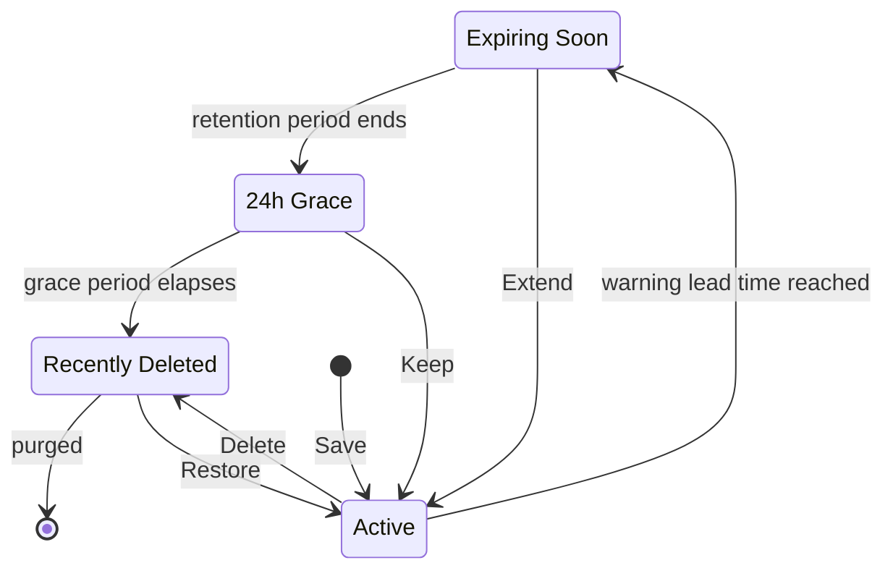

# The Last Bookmark Bender

Temporary bookmarks with retention rules, expiration warnings, and a final 24-hour grace period — so “read later” links stop living forever.

## What it does

1. **Save** the current page into a dedicated `lastbookmark` folder (popup, right-click → **Bend this page**, or **Alt+Shift+B**).
2. **Get warned** shortly before the retention period ends (click the notification to open the page).
3. **Final 24 hours** — at expiration, the bookmark enters a grace period with Keep / Delete actions.
4. **Deletion** — unused bookmarks are removed automatically; recently deleted items can be restored from the popup.

The toolbar badge shows how many bookmarks are expiring soon or in the final grace period.

## Lifecycle

The warning lead time scales with the retention period: 15 minutes under 6 hours, 1 hour up to 48 hours, otherwise 24 hours. **Extend** and **Keep** both reset the deadline to the full retention period, so a bookmark can loop back to *Active* from any state until it is purged.

## Install (local / developer)

1. Open `chrome://extensions`
2. Enable **Developer mode**
3. **Load unpacked** → select this repository folder
4. Complete onboarding (choose default retention)

## Permissions

| Permission | Why |
|---|---|
| `bookmarks` | Create/manage the temporary bookmark folder |
| `storage` | Settings, retention metadata, recently deleted |
| `tabs` / `activeTab` | Read the active page title and URL when saving |
| `alarms` | Periodic expiration checks |
| `notifications` | Warning, grace, and deletion alerts |
| `contextMenus` | “Bend this page” on page/link context menus |

## Privacy

All data stays on your device. See [`PRIVACY.md`](PRIVACY.md) (GitHub / Store) and [`privacy/privacy.html`](privacy/privacy.html) (in-extension).

For the **Chrome Web Store**, paste the public GitHub URL to `PRIVACY.md`, for example:

`https://github.com/sevilayerkan/the-last-bookmark-bender/blob/main/PRIVACY.md`

Store listing copy and permission justifications: [`store/listing.md`](store/listing.md).

## Settings

Open the extension options page to change:

- Default retention duration
- Warning before expiration
- Notification after deletion
- Export settings + bookmarks as JSON

Keyboard shortcut defaults to **Alt+Shift+B** (customize at `chrome://extensions/shortcuts`).

## Limits

- Up to **100** active temporary bookmarks
- Up to **50** recently deleted entries

## Development notes

- Manifest V3 service worker: `background/service-worker.js`
- Shared logic: `shared/` (`bookmarks`, `retention`, `storage`, `deleted`, `constants`)
- UI: `popup/`, `settings/`, `onboarding/`, `privacy/`
- Tests: `npm test` (Node 18+; does not load in Chrome)

## Contributing

Bug reports and feature ideas are welcome via GitHub issues. Unsolicited pull requests are not accepted — see [`CONTRIBUTING.md`](CONTRIBUTING.md).

## License

This project is open source under the [MIT License](LICENSE).
